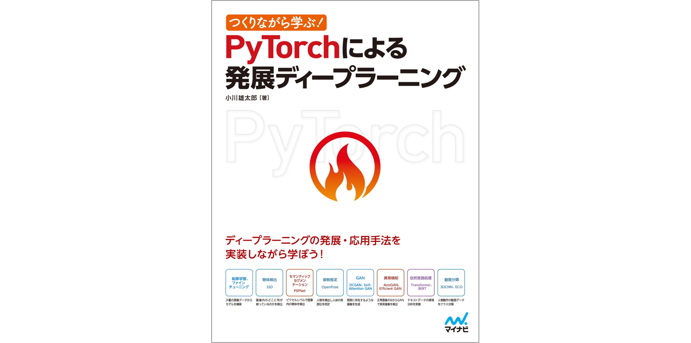

## つくりながら学ぶ! PyTorchによる発展ディープラーニング

 

[書籍「つくりながら学ぶ! PyTorchによる発展ディープラーニング」（小川雄太郎、マイナビ出版 、19/07/29) ](https://www.amazon.co.jp/dp/4839970254/)

のサポートリポジトリです。

 

### 1. 本書で扱うタスク内容とディープラーニングモデル

- 第1章 画像分類と転移学習（VGG）
- 第2章 物体認識（SSD）
- 第3章 セマンティックセグメンテーション（PSPNet）
- 第4章 姿勢推定（OpenPose）
- 第5章 GANによる画像生成（DCGAN、Self-Attention GAN）
- 第6章 GANによる異常検知（AnoGAN、Efficient GAN)
- 第7章 自然言語処理による感情分析（Transformer）
- 第8章 自然言語処理による感情分析（BERT）
- 第9章 動画分類（3DCNN、ECO）

本書の詳細な内容については、以下で別途、解説しております。

[「Qiita記事：PyTorchによる発展ディープラーニング、各章の紹介」](https://qiita.com/sugulu/items/07253d12b1fc72e16aba)

 

### 2. 疑問点・修正点はIssueにて管理しています

本GitHubのIssueにて、疑問点や修正点を管理しています。

不明な点などがございましたら、こちらをご覧ください。

https://github.com/YutaroOgawa/pytorch_advanced/issues

### 3. 誤植について

書籍中の誤植一覧はこちらになります。
大変申し訳ございません。

[誤植一覧](https://github.com/YutaroOgawa/pytorch_advanced/issues?q=is%3Aissue+is%3Aopen+label%3A%E8%AA%A4%E6%A4%8D)
